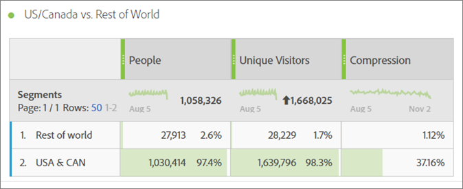
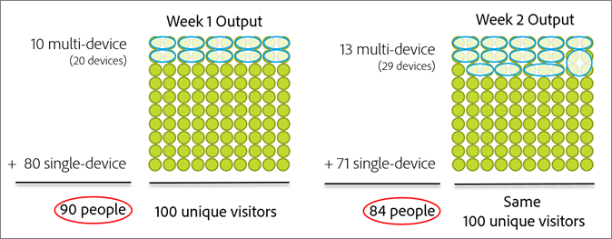
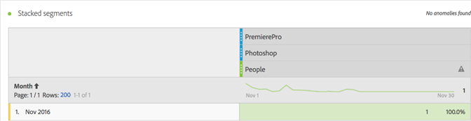
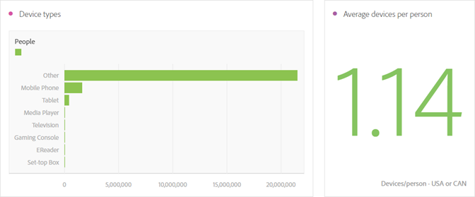
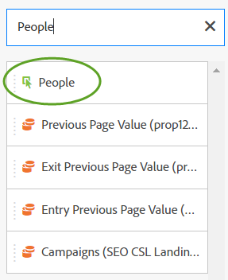

# 人物指標{#people-metric}

人物指標は、デバイスグラフに基づく人 ( またはAdobeのグループ ) の数です。 Analysis Workspaceでは、デバイスをまたいで訪問者を識別するために、人物指標を適用できます。

## 人物指標の前提条件と考慮事項 {#section-34551d0435fb4b3cb3fad736b7961541}

<table id="table_120F7EF50042485391E58B22DD00A2A8"> 
 <thead> 
  <tr> 
   <th colname="col1" class="entry"> 前提条件または検討事項 </th> 
   <th colname="col2" class="entry"> 説明 </th> 
  </tr>
 </thead>
 <tbody> 
  <tr> 
   <td colname="col1"> 
Device Co-op 
 </td> 
   <td colname="col2"> 
 人物指標を使用するには、 <a href="http://landing.adobe.com/en/na/events/summit/275658-summit-co-op.html" format="html" scope="external"> Adobe Experience Cloud Device Co-op</a>. Co-op は、個人の複数のデバイス ( またはExperience CloudID) を識別します。 Analytics は、この情報を利用して、ブランドとやり取りする人の数を統計的に導きます。 指標の精度は 5%以内です。 
 
<b>地域</b>:Device Co-op は現在、米国およびカナダでのみご利用いただけます。 したがって、人物指標を評価する場合は、米国およびカナダのみのデータをフィルタリングする分析にセグメントを適用する必要があります。 
 
Device Graph は毎週 Co-op の新しいバージョンを計算し、使用するために公開します。 火曜日に、システムは最新のデータを収集し、更新されたバージョンのグラフを公開します。 Experience Cloudソリューションは、最新バージョンのグラフを使用します。 特に、Analytics では、変更は水曜日に読み込まれ、処理では通常、1 ～ 2 営業日かかります。 
 
 
重要：グラフが週単位で更新される場合、過去に人物指標に影響を与える可能性があります。 つまり、過去のユーザー数は、時間の経過と共にグラフが学習し、更新されると変化する可能性があります。 例えば、先月「人」をカウントする今日のレポートを実行し、グラフの更新後 1 週間以内に同じレポートを実行した場合、過去の「人」のカウントは若干変更される可能性があります。 
 
 </td> 
  </tr> 
  <tr> 
   <td colname="col1"> 指標の権限 </td> 
   <td colname="col2"> 
人物指標は、その人物指標へのアクセス権を付与されている場合にのみ使用できます。 管理者が実行できる<a href="https://docs.adobe.com/content/help/en/analytics/admin/user-product-management/customize-report-access/groups-metrics.html" format="html" scope="external"> 指標の権限のカスタマイズ</a> 」をクリックします。 
 </td> 
  </tr> 
  <tr> 
   <td colname="col1"> IMS 組織へのマッピング </td> 
   <td colname="col2"> 
人物指標は、 <a href="https://docs.adobe.com/content/help/ja-JP/core-services/interface/about-core-services/report-suite-mapping.html" format="html" scope="external"> IMSORG にマッピングされる</a>. 
 </td> 
  </tr> 
  <tr> 
   <td colname="col1"> 
Analysis プロジェクト/ツール 
 </td> 
   <td colname="col2"> 
での人物指標の使用  Analysis Workspace,  Ad Hoc Analysis,  Report Builder、API 経由で取得できます。 計算指標を含め、個別訪問者数指標を使用する場所であればどこでも使用できます。 
 
例えば、1 人あたりの売上高指標を作成して、個別訪問者あたりの売上高指標を置き換えます。 
 
A <a href="https://docs.adobe.com/content/help/ja-JP/analytics/analyze/analysis-workspace/build-workspace-project/starter-projects.html" format="html" scope="external"> 人物プロジェクトテンプレート</a> は、Analysis Workspaceで人物指標の使用を開始するために使用できます。 
 </td> 
  </tr> 
  <tr> 
   <td colname="col1"> 
ボットルールを有効にする 
 </td> 
   <td colname="col2"> 
Adobeでは、 <a href="https://docs.adobe.com/content/help/en/analytics/admin/admin-tools/bot-removal/bot-rules.html" format="html" scope="external"> ボットルール</a>（特に人物指標を使用する場合） 
 
ボットが Web サイトをクロールすると、個別訪問者数が人為的に増加します。 レポートスイートからボットトラフィックを削除すると、個別訪問者数とユーザー数の両方で、デジタルプロパティに関するアクティビティをより正確に測定できます。 
 
これをおこなうには、  Analytics &gt;  管理者 &gt;  レポートスイート. 適切なレポートスイートを選択し、  設定を編集 &gt;  一般 &gt;  ボットルール. 
 </td> 
  </tr> 
  <tr> 
   <td colname="col1"> 
セグメント化に関する考慮事項 
 </td> 
   <td colname="col2"> 
 人物指標でセグメントを使用する場合、指標レポートは予想より大幅に低くなる可能性があります。 
 
詳しくは、 <a href="../other-solutions/people.md#section-d03525420dbe48379fd95b230ef05885" format="dita" scope="local"> セグメントでの人物指標の使用</a>. 
 </td> 
  </tr> 
 </tbody> 
</table>

## 人物指標とは {#section-89e2b8f5e80f480391449fc8d1117a6a}

人物指標は、デバイスを人物に関連付けるのに役立つ Analytics レポート指標です。 マーケティングに関する人ベースのビューを提供し、あらゆるデバイスでの訪問者のアクティビティを測定できます。 これは、重複を排除した個別訪問者数のバージョンと考えて、以前個別訪問者数を使用した分析に人物指標を使用できます。

**デバイスは人物**

人物指標が利用可能になる前に、ある人（例えば）がサイトを訪問し、3 つの異なるデバイスでキャンペーンやブランドに関わり、数分以内に購入することもあります。 実装によっては、各デバイスを個別訪問者としてレポートし、10 ドルを 30 ドルの購入で 3 台のデバイスに結び付けることができます。

人物指標を使用すると、30 ドルの購入を 1 人の人物に正確に関連付けることができます。

**レポートの精度の向上**

人物指標を使用すると、複数のデバイスを単一のエンティティと考えることができます。 次のAnalysis Workspaceプロジェクトでは、実訪問者数レポートと人物レポートの精度の比較を示しています。

人物と実訪問者を並べて比較する：

**定義**

<table id="table_F8171AF15DA64607B427E3739EF004D6"> 
 <thead> 
  <tr> 
   <th colname="col1" class="entry"> 項目 </th> 
   <th colname="col2" class="entry"> 説明 </th> 
  </tr>
 </thead>
 <tbody> 
  <tr> 
   <td colname="col1"> 
People 
 </td> 
   <td colname="col2"> 
人物指標は、消費者が複数のデバイスを使用してブランドとやり取りするという考えに基づいています。 データのスライスまたはセグメント化が増えるほど、同じ人物がそのデータのスライス内で複数のデバイスを使用する可能性が低くなります。 
 </td> 
  </tr> 
  <tr> 
   <td colname="col1"> 
ユニーク訪問者 
 </td> 
   <td colname="col2"> 
例えば、日付や時刻でデータをスライスするほど、人物と実訪問者数の違いは小さくなります。 Device Co-op の全体的な影響を適切に把握したい場合、Adobeでは過去 90 日間の日付範囲を使用することをお勧めします 
 </td> 
  </tr> 
  <tr> 
   <td colname="col1"> 
圧縮 
 </td> 
   <td colname="col2"> 
シンプルな計算指標を使用すると、実訪問者に対して人の指標がどれくらい小さいかを割合で確認できます。 上の表の「圧縮」の横にある情報アイコンをクリックして、この指標の作成方法を確認します。 
 
人物は、個別訪問者数の代わりに他の計算指標で使用できます。 
 </td> 
  </tr> 
 </tbody> 
</table>

## 人物指標はどのように計算されますか？ {#section-0dfb762867e14a7f927796ef3c50592b}

<!--

Analytics uses the HyperLogLog statistical algorithm to calculate People. This means that the smaller the data set, the margin for error may increase. No more than 5% of the numbers should be off by more than 5% 

-->

次の図は、人物指標の計算方法と、過去の同じレポート日付範囲で、時間の経過に伴ってどのように減少するかを示しています。

この例では、訪問者の固定セットがあるとします。 過去の一定期間に対してレポートを実行すると、一定の訪問者数が表示されます。 デバイスグラフが 1 週目の左の図に示すデータを出力すると、90 人のユーザーが得られます。 1 週間後、次回デバイスグラフを実行した後、新しい情報が考慮されます。 1 週間前と同じレポートを実行した場合、人数は 84 人に減少しています。 デバイスグラフが、グループ化する必要のあるデバイスに関する新しい情報を提供したので、履歴が変更されました。

## セグメントでの人物指標の使用 {#section-d03525420dbe48379fd95b230ef05885}

人物指標でセグメントを使用する場合、指標の結果は予想より大幅に低くなる可能性があります。 この問題は、セグメント化で、 *`person`* コンテナ。 セグメント化では、訪問者コンテナを使用します。訪問者コンテナは、定義の最上位のコンテナで、人物ではなくデバイスに基づいています。

この問題は、主に人物指標でセグメントを積み重ねる際に発生します。

セグメントを積み重ねると、セグメントの組み合わせを表す新しいセグメントが作成されます。 セグメントの積み重ねは、次の場合に発生します。

* Analysis Workspaceの別のセグメントの上にセグメントを配置する。 ( これらは、 *`And`* 演算子 )
* 次を含む単一のセグメントを適用： *`And`* 演算子
* プロジェクトレベルとテーブルレベルの両方でセグメントを適用します。
* 別のセグメントで仮想レポートスイートを使用する。

例えば、人物指標に次のセグメントを積み重ねるとします。

* `Campaign = Spring Promotion`
* `Site Section = Product Overview`

両方のセグメントで適合する人の数のみ *`using a single device`* がカウントされます。 （人物指標には、デバイスをまたいで適格な人の数は表示されません）。

また、 *`Or`* の演算子は、この状況では推奨されません。 これにより、どちらか一方を見た人の数が得られ、両方のセグメントに適合する人の数はカウントできません。

詳しくは、 [セグメントの作成](https://docs.adobe.com/content/help/ja-JP/analytics/components/segmentation/segmentation-workflow/seg-build.html) （セグメント化ヘルプ）を参照してください。

## デバイスタイプ {#section-8ab378c84ff34574b9c20fecb3848a86}

Device Co-op と人の指標は、レポートスイートに複数のデバイスタイプのデータが含まれている場合に、Adobe Analyticsで最も適しています。 例えば、同じレポートスイートで Web データとアプリデータを組み合わせることで、人物指標の精度が高まり、効果的になります。 データに重複するデバイスが多いほど、複数の個別訪問者が 1 人のユーザーとしてグループ化される可能性が高くなります。

## Experience CloudID サービスの対象範囲 {#section-bbf0098cac2e467289e7a644a1dea05c}

Device Co-op では、Experience CloudID(MCID) サービスを使用してデジタルプロパティを実装する必要があります。 レポートスイートのデータに MCID を持たない訪問者が大量に含まれている場合、Device Co-op と人物指標の有効性は低下します。

<!--
mcdc-people-metric-apply.xml
-->

Analysis Workspaceで、 [プロジェクト](https://docs.adobe.com/content/help/ja-JP/analytics/analyze/analysis-workspace/build-workspace-project/t-freeform-project.html)をクリックし、 **[!UICONTROL People]** プロジェクトテーブルの指標：

