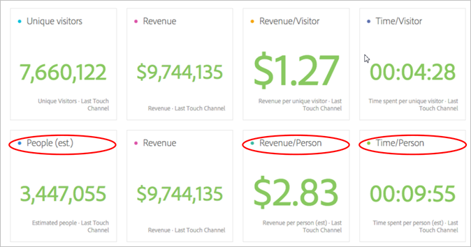

# 人物指標{#people-metric}

人物指標は、アドビのDevice Graphに基づく人（またはデバイスのグループ）の数です。 人物指標を適用して、分析ワークスペースのデバイス間で訪問者を識別できます。

## 人物指標の前提条件と考慮事項 {#section-34551d0435fb4b3cb3fad736b7961541}

<table id="table_120F7EF50042485391E58B22DD00A2A8"> 
 <thead> 
  <tr> 
   <th colname="col1" class="entry"> 前提条件または考慮事項 </th> 
   <th colname="col2" class="entry"> 説明 </th> 
  </tr>
 </thead>
 <tbody> 
  <tr> 
   <td colname="col1"> 
デバイス Co-op 
 </td> 
   <td colname="col2"> 
 人物指標を使用するには、 <a href="http://landing.adobe.com/en/na/events/summit/275658-summit-co-op.html" format="html" scope="external"> Adobe Experience Cloud Device Co-opのメンバーになります</a>。 Co-opは、人の複数のデバイス（またはExperience Cloud ID）を識別します。 Analyticsは、この情報を利用して、ブランドとやり取りする人の数を統計的に導きます。 指標の正確性は5 %以内です。 
 
<b>地域</b>: Device Co-opは現在、米国およびカナダでのみご利用いただけます。 したがって、人物指標を評価する場合は、米国とカナダのみのデータをフィルターするセグメントを分析に適用する必要があります。 
 
Device Graphは毎週Co-opの新しいバージョンを計算し、使用するために公開します。 火曜日に、システムは最新のデータを収集し、更新されたバージョンのグラフを公開します。 次に、Experience Cloudソリューションは最新バージョンのグラフを使用します。 特にAnalyticsでは、変更は水曜日に読み込まれ、処理には通常1 ～ 2営業日かかります。 
 
 
重要：  グラフが毎週更新される場合、訪問者指標は過去に遡って影響を受ける可能性があります。 つまり、過去の訪問者数は、グラフが学習し、更新されると、時間の経過とともに変化する可能性があります。 例えば、先月「人」というレポートをカウントし、グラフの更新後1週間で同じレポートを実行する今日のレポートを実行した場合、「人」のカウント履歴が少し変わる可能性があります。 
 
 </td> 
  </tr> 
  <tr> 
   <td colname="col1"> 指標権限 </td> 
   <td colname="col2"> 
人物指標は、その人物指標へのアクセス権を付与されている場合にのみ使用できます。 管理者は<a href="https://docs.adobe.com/content/help/en/analytics/admin/user-product-management/customize-report-access/groups-metrics.html" format="html" scope="external"> 、管理ツールで指標の権限をカスタマイズできます</a> 。 
 </td> 
  </tr> 
  <tr> 
   <td colname="col1"> IMS組織へのマッピング </td> 
   <td colname="col2"> 
人物指標は、IMSORGにマップされているすべてのレポートスイートで有効にな <a href="https://docs.adobe.com/content/help/ja-JP/core-services/interface/about-core-services/report-suite-mapping.html" format="html" scope="external"> ります</a>。 
 </td> 
  </tr> 
  <tr> 
   <td colname="col1"> 
分析プロジェクト/ツール 
 </td> 
   <td colname="col2"> 
分析ワークスペース  、アドホック分析  、Report Builder 、APIを介して、ユーザー指標を使用します。 計算指標を含め、どこで実訪問者数指標を使用しても、この指標を使用できます。 
 
例えば、1人あたりの売上高指標を作成して、個別訪問者あたりの売上高指標を置き換えます。 
 
Peopleプロジェクトテンプレート  (People Project)を使用して、分析ワークスペースの人物指標を使い始めることができます。 
 </td> 
  </tr> 
  <tr> 
   <td colname="col1"> 
ボットルールを有効にする 
 </td> 
   <td colname="col2"> 
特に人物指標を使用する場合は、 <a href="https://docs.adobe.com/content/help/en/analytics/admin/admin-tools/bot-removal/bot-rules.html" format="html" scope="external"> ボットルール</a>(Bot Rules)をオンにすることをお勧めします。 
 
ボットがWebサイトをクロールすると、個別訪問者数が人為的に増加します。 レポートスイートからボットトラフィックを削除すると、個別訪問者数と個人数の両方の観点から、デジタルプロパティのアクティビティをより正確に測定できます。 
 
その場合は、  Analytics /  管理者 /  レポートスイートに移動します。 Select the correct report suite, and then go to  Edit Settings &gt;  General &gt;  Bot Rules. 
 </td> 
  </tr> 
  <tr> 
   <td colname="col1"> 
セグメントに関する考慮事項 
 </td> 
   <td colname="col2"> 
 人物指標でセグメントを使用する場合、指標のレポートが予想より大幅に低くなる可能性があります。 
 
詳しくは、「セグメントでの人物指標の使用 」を参照してください。 
 </td> 
  </tr> 
 </tbody> 
</table>

## 人物指標とは何ですか。 {#section-89e2b8f5e80f480391449fc8d1117a6a}

人物指標は、デバイスを人に結び付けるのに役立つAnalyticsレポート指標です。 これにより、人ベースのマーケティング表示が提供され、すべてのデバイスにわたる訪問者のアクティビティを測定できます。 重複を排除した個別訪問者と考え、以前個別訪問者を使用した分析に人物指標を使用できます。

**デバイスはユーザー**

人物指標が利用可能になる前に、ある人（例えば）がサイトを訪問し、3つの異なるデバイスでキャンペーンやブランドに関与して購入を行う場合があります（数分以内に行う場合もあります）。 導入に応じて、Analyticsは、各デバイスを個別訪問者としてレポートし、$30の購入で10 ～ 3のデバイスと見なすことがあります。

人物指標を使用すると、30ドルの購入を1人の人物に正確に関連付けることができます。

**レポートの精度の向上**

人物指標を使用すると、複数のデバイスを単一のエンティティと考えることができます。 次の分析ワークスペースプロジェクトは、実訪問者レポートと個人レポートの間の精度の比較を強化したものです。

人物と個別訪問者を並べて比較：

**定義**

<table id="table_F8171AF15DA64607B427E3739EF004D6"> 
 <thead> 
  <tr> 
   <th colname="col1" class="entry"> 項目 </th> 
   <th colname="col2" class="entry"> 説明 </th> 
  </tr>
 </thead>
 <tbody> 
  <tr> 
   <td colname="col1"> 
People 
 </td> 
   <td colname="col2"> 
人物指標は、消費者が複数のデバイスを使用してブランドとやり取りするという考えに基づいています。 データのスライスやセグメント化を行うほど、同じユーザーがそのデータスライス内の複数のデバイスを使用する確率が低くなります。 
 </td> 
  </tr> 
  <tr> 
   <td colname="col1"> 
個別訪問者数 
 </td> 
   <td colname="col2"> 
例えば、日時別にデータをスライスするほど、個人訪問者と個別訪問者の違いは小さくなります。 Device Co-opの全体的な影響を十分に理解したい場合は、過去90日間の日付範囲を使用することをお勧めします。 
 </td> 
  </tr> 
  <tr> 
   <td colname="col1"> 
圧縮 
 </td> 
   <td colname="col2"> 
単純な計算指標を使用すると、人物指標がどれだけ小さいかを、実訪問者数に対する割合で示すことができます。 上の表の「圧縮」の横にある情報アイコンをクリックして、この指標の作成方法を確認してください。 
 
個別訪問者数の代わりに、他の計算指標で使用できます。 
 </td> 
  </tr> 
 </tbody> 
</table>

## 人物指標の計算方法 {#section-0dfb762867e14a7f927796ef3c50592b}

<!--

Analytics uses the HyperLogLog statistical algorithm to calculate People. This means that the smaller the data set, the margin for error may increase. No more than 5% of the numbers should be off by more than 5% 

-->

次の図に、人物指標の計算方法と、過去の同じレポート日付範囲で、時間の経過と共に減少する可能性を示します。

この例では、固定訪問者セットがあるとします。 過去に一定の期間のレポートを実行した場合は、一定の訪問者が表示されます。 デバイスグラフが1週目の左の図に示すデータを出力する場合、90人になります。 1週間後、Device Graphの次回実行後、新しい情報が考慮されます。 1週間前と同じレポートを実行すると、訪問者数は84人に減ります。 履歴が変更されました。Device Graphが、グループ化するデバイスに関する新しい情報を提供したためです。

## セグメントでの人物指標の使用 {#section-d03525420dbe48379fd95b230ef05885}

人物指標でセグメントを使用する場合、指標の結果が予想より大幅に低くなる場合があります。 この問題は、セグメント化で *`person`* コンテナが発生しないために発生します。 セグメント化では、訪問者コンテナを使用します。これは、定義の中で最も高いレベルのコンテナであり、ユーザーではなく、デバイスに基づいています。

この問題は主に、人物指標でセグメントを積み重ねる場合に発生します。

セグメントを積み重ねると、セグメントの組み合わせを表す新しいセグメントが作成されます。 セグメントの積み重ねは、次の場合に必ず行われます。

* セグメントを分析ワークスペース内の別のセグメントの上に配置します。 (これらは、 *`And`* 演算子を使用して自動的に結合されます)。
* 演算子を含む単一のセグメントを適用し *`And`* ます。
* プロジェクトレベルと表レベルの両方でセグメントを適用します。
* 別のセグメントで仮想レポートスイートを使用する。

例えば、人物指標に次のセグメントを積み重ねたとします。

* `Campaign = Spring Promotion`
* `Site Section = Product Overview`

両方のセグメントに該当する人の数のみがカウント *`using a single device`* されます。 （人物指標には、デバイス間の資格を持つ人の数は表示されません）。

また、この状況では、 *`Or`* 演算子の使用は推奨されません。 この設定を行うと、1人または他の人を見た人の数が得られ、両方のセグメントに該当する人の数はカウントされません。

詳しくは、セグメント化ヘルプの [セグメントの作成](https://docs.adobe.com/content/help/ja-JP/analytics/components/segmentation/segmentation-workflow/seg-build.html) （英語）を参照してください。

## デバイスタイプ {#section-8ab378c84ff34574b9c20fecb3848a86}

Device Co-opとPeople指標は、レポートスイートに複数のデバイスタイプからのデータが含まれている場合、Adobe Analyticsで最も効果的です。 例えば、同じレポートスイートでWebデータとアプリデータを組み合わせると、人物指標の強力さと効率性が向上します。 データ内でのデバイスの重複が多いほど、複数の個別訪問者が1人のユーザーとしてグループ化される可能性が高くなります。

## Experience Cloud ID Service Coverage {#section-bbf0098cac2e467289e7a644a1dea05c}

Device Co-opでは、Experience Cloud ID(MCID)サービスを使用してデジタルプロパティを実装する必要があります。 レポートスイート内のデータにMCIDを持たない訪問者が大量に含まれている場合、Device Co-opとPeople指標の効果は低下します。

<!--
mcdc-people-metric-apply.xml
-->

分析ワークスペースで、 [プロジェクトを作成し](https://docs.adobe.com/content/help/en/analytics/analyze/analysis-workspace/build-workspace-project/t-freeform-project.html)、 **[!UICONTROL People]** 指標をプロジェクトテーブルにドラッグします。

