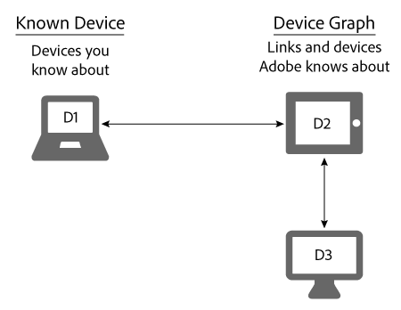

# Known devices{#known-devices}

Device Graphの既知のデバイスについて

In the Device Graph, we have the concept of a *`known device`*. 既知のデバイスとは、顧客がブランドとのやり取りに使用するデバイスです。

>[!NOTE]
>
>では、 [!DNL Adobe Experience Cloud Device Co-op]、などの用 *`device`*&#x200B;語 *`person`*&#x200B;が *`identity`* 、 の用語には、特別の意味があります。例えば、「デバイス」は、スマートフォンやタブレットなどの物理的はハードウェアを指したり、ハードウェア上で実行されるアプリケーションを指すことがあります。定義については、[用語集](../glossary.md#glossgroup-0f47d7fbd76c4759801f565f341a386c)を参照してください。

## Supporting goals with the known device {#section-80deae33660e4280ac65c659ceff5601}

既知のデバイスの概念は、効果的な [!DNL Device Co-op] プログラムの作成と維持に不可欠ないくつかの目標をサポートします。既知のデバイスは、[!DNL Device Co-op] メンバーが消費者とのインタラクション（サイト訪問やモバイルアプリの使用など）によって認識しているデバイスです。Based on these actions, the [!DNL Device Graph] links the known devices of a [!DNL Device Co-op] member to devices contributed by other [!DNL Device Co-op] members. これらのリンクは、決定的なも [のでも確率的なものでも](../processes/links.md#concept-58bb7ab25f904f5f98d645e35205c931)、 This benefits [!DNL Device Co-op] members because they receive:

* 既知のデバイスに関するより多くのデータ。
* その他の、リンクされたデバイスに関する新しい情報。

The [!DNL Device Graph] will not provide information about device-clusters that a Device Co-op member has not seen.

## Device Co-op goals {#section-75aea5a102d54733aae2a7c6ee9ec6c7}

Three main goals animate the [!DNL Device Co-op]. 以下が含まれます。

* **規模：**&#x200B;デバイスグラフの使用規模にかかわらず、できる限り多くのリンクを共有できるようにします。
* **公平性：**[!DNL Device Co-op] の各メンバーが、貢献に見合ったメリットを享受できるようにします。

* **消費者の信頼：**&#x200B;消費者のクロスデバイスエクスペリエンスに、消費者が既に知っており信頼しているブランドが関わるようにすることで、消費者の信頼感を維持および構築します。

## Scale and the known device {#section-67f734109762457ca62ec306284ea082}

次の方法は、デバイスが既知のデバイスとして認識される一般的な方法です。 これらの方法により、[!DNL Device Co-op] メンバーには、ほとんどの場合、少なくとも 1 個の既知のデバイスがあることになります。これは、[!DNL Device Co-op] のすべてのメンバーに最大数のリンクを提供するという目標の達成に役立ちます。

**オーガニック**

* 顧客によるサイトへの訪問、またはアプリの使用によって。これは、ファーストパーティデータからの認定です。
* CRM システムからの顧客のオンボーディングによって。

**マーケットプレイス**

* Audience Marketplace からのセグメントデータの購入。
* サードパーティのデータプロバイダーからのデータ購入から。

**広告**

オークションで広告インベントリを獲得し、デバイスに広告を提供することによって。その広告に [!DNL Audience Manager] ピクセルが含まれている場合、デバイスが既知のデバイスになります。

## Known devices and fairness use cases {#section-0543188729d845d6b95db70b8b25e9f8}

Members of the [!DNL Device Co-op] get links commensurate with their contributions to the [!DNL Device Graph]. Companies that contribute a lot of devices to the [!DNL Device Graph] receive more links than members who contribute just a few. アドビでは、これによって、[!DNL Device Co-op] がすべてのメンバーにとって公平なものになると考えています。以下で説明する大規模および小規模の使用例で、これがどのように機能するかを見てみましょう。

**ブランドA:大規模な使用事例**

この例では、ブランド A には毎月 100 人のサイト訪問者があり、新しいクロスデバイスのブランドキャンペーンを開始します。For simplicity, assume the [!DNL Device Graph] knows all of the visitors to Brand A are linked to 1 additional device. これは、ブランドAが別の100台のデバイスに到達できることを意味します。 Additionally, the [!DNL Device Graph] contains about 200 devices linked together.

<table id="table_78C38DC522F94BC38C1DB73740C058AC"> 
 <thead> 
  <tr> 
   <th colname="col1" class="entry"> 既知のデバイス/月 </th> 
   <th colname="col2" class="entry"> Device Co-op から受け取ったリンク済みデバイス </th> 
   <th colname="col3" class="entry"> キャンペーンの合計デバイス数 </th> 
  </tr>
 </thead>
 <tbody> 
  <tr> 
   <td colname="col1"> 
100 
 </td> 
   <td colname="col2"> 
100 
 </td> 
   <td colname="col3"> 
200 
 </td> 
  </tr> 
 </tbody> 
</table>

**ブランド B：小規模の使用例**

この例では、ブランド B には毎月 100 人のサイト訪問者があり、新しいクロスデバイスのブランドキャンペーンを開始します。For simplicity, assume the [!DNL Device Graph] knows all of the visitors to Brand B are linked to 50 additional devices. これは、ブランド B が 150 個のデバイスにリーチできることを意味します。Additionally, the [!DNL Device Graph] contains about 1,000 devices linked together.

<table id="table_A6C9CCF9C6564A89BA7060E075A8E73C"> 
 <thead> 
  <tr> 
   <th colname="col1" class="entry"> 既知のデバイス/月 </th> 
   <th colname="col2" class="entry"> Device Co-op から受け取ったリンク済みデバイス </th> 
   <th colname="col3" class="entry"> キャンペーンの合計デバイス数 </th> 
  </tr>
 </thead>
 <tbody> 
  <tr> 
   <td colname="col1"> 
100 
 </td> 
   <td colname="col2"> 
50 
 </td> 
   <td colname="col3"> 
150 
 </td> 
  </tr> 
 </tbody> 
</table>

>[!MORELIKETHIS]
>
>* [未知のデバイス](../processes/unknown-device.md#concept-95090d341cdc4c22ba4319d79d8f6e40)

