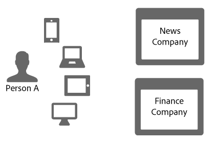
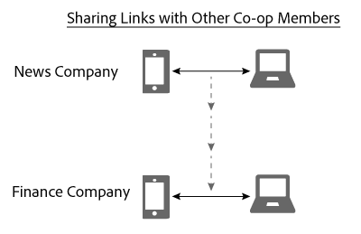

# デバイスグラフでのリンク共有{#link-sharing-in-the-device-graph}

デバイスグラフでのリンク共有について

この [!DNL Device Graph] は、決定論的リンクと確率論的リンクをAdobe Experience Cloud Device Co-op の様々なメンバーと共有します。 リンク共有が [!DNL Device Co-op] 非常に強力な これは、匿名人物に関連付けられたデバイスに関して各メンバーが把握している内容を拡張しますが、その匿名人物のデバイスの 1 つ以上を以前に見たことがある場合にのみ有効です。

## デバイスグラフの概要の確認 {#section-7858e9f61b5644c981ffb53626fcc19d}

使用を開始する前に、 [!DNL Device Graph] は機能します。 のメンバー [!DNL Device Co-op] にデータを送信する [!DNL Device Graph]. この [!DNL Device Graph] は、このデータを使用して、人物の ID を構築します。 [決定論的リンクと確率論的リンク](../processes/links.md#concept-58bb7ab25f904f5f98d645e35205c931) デバイス間 As a [!DNL Device Co-op] 参加者の場合、これらのリンクは、認証済みユーザー、他のユーザーおよびデバイス間の関係に関するインサイトを提供します。 この機能については、以下の節で説明します。

## リンク共有の例 {#section-cb410d827cf14f76bc9b0bd4d31ed767}

次の例は、Device Co-op でのリンク共有の機能を示しています。 この例では、News Company と Finance Company の 2 つの架空の会社があります。 両社とも、 [!DNL Device Co-op]. ユーザー A とは、複数のデバイスから各会社の Web サイトにログオンまたは閲覧する消費者です。

ユーザー A は携帯電話やタブレットでニュースサイトを認証しているので、ニュース会社は消費者 ID で識別します。 その ID を [!DNL Device Graph] を暗号化ハッシュとして使用します。 金融会社は以前にこれらのデバイスを見たことがありますが、人物 A はサイトにログオンしていません。 したがって、財務会社は、これらのデバイスが相互にどのように関連しているか、またはどのように個人 A と関連付けられているかを把握しません。

消費者 ID の暗号化ハッシュが指定され、 [!DNL Device Graph] は、これらのデバイスが互いに関連し、特定の人物であることを認識します。 ～に参加しない会社へ [!DNL Device Co-op] これらのサイト訪問は、別々のランダムなデバイスから来たもののように見えます。 いずれにしても、 [!DNL Device Graph] には次のハッシュ化された ID があります。

* 携帯電話とノートパソコンがリンクされていることを認識します。
* 金融会社が、携帯電話とノートパソコンがリンクされているかどうかを知りたがっていることを認識します。

これらの条件を考えると、 [!DNL Device Graph] は、ニュース会社のこれらのデバイスと金融会社を結ぶリンクを共有します。 このプロセスの間、 [!DNL Device Graph] は、ある co-op メンバーから別のメンバーへのリンクを複製して共有します。

この時点で、 [!DNL Device Graph] が正常に役割を実行しました。 ニュース会社も金融会社も、身元を明確に示しています。 すべてのデバイスをまたいで、正確にユーザー A にリーチできます。

## プライバシーとリンク共有 {#section-7b566018b3304420a4b3e4c079826110}

の消費者のプライバシーとデータの整合性の維持 [!DNL Device Co-op] メンバーは、リンク共有プロセス全体で非常に重要です。 この顧客の識別およびリンク共有プロセスの間、 [!DNL Device Graph] 次の場合は実行されませんでした。

* 財務会社に、そのリンクがニュース会社から来たことを伝えます。
* 1 人で使用する顧客 ID を共有 [!DNL Device Co-op] メンバーを別のメンバーと共に使用する。
* モバイルデバイスとノートパソコンがリンクを共有している以外の情報を提供します。

## 次の手順 {#section-ac6e61f1eb6e45b1bb4be8ece39147c7}

ID、リンク、リンク共有に関するドキュメントを読むと、 [!DNL Device Graph] データを内部で構築します。 次のステップとして、の概念を説明するドキュメントを見てみることをお勧めします。 *`known device`* は、デバイス間のリンクを Device Co-op メンバーに配信します。 詳しくは、 [既知のデバイス](../processes/known-device.md#concept-8e87c276819a48bfac5cef10b45216d1) および [不明なデバイス](../processes/unknown-device.md#concept-95090d341cdc4c22ba4319d79d8f6e40).
