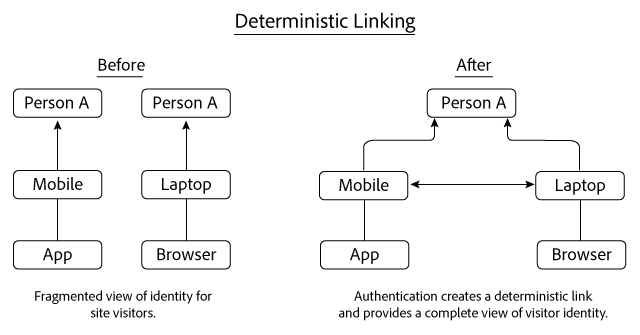
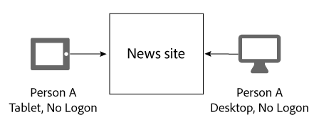
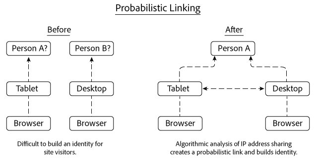
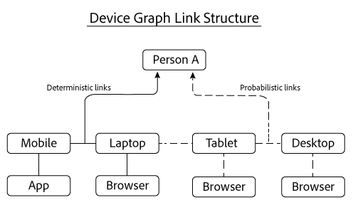

# 決定論的リンクと確率的リンク{#deterministic-and-probabilistic-links}

Device Graphでの決定論的データと確率的データの分析方法により、デバイスを相互にリンクするマップを作成します。

では、内部プ [!DNL Device Graph]ロセスは、デバイスをマッピングし、匿名化された個々の人々に接続するアイデンティティ階層を構築します。 グラフの出力には、ターゲット設定に使用できるデバイス間のリンクと、一部のExperience Cloudソリューションで公開されたデータが含まれます。 データを使用するアドビのソリューシ [!DNL Device Graph] ョンには、Analytics、オーディエンスマネージャー、Media Manager、ターゲットがあります。

決定論的 [!DNL Device Graph] および確率的データを分析し、デバイスを相互にリンクするマップを作成します。 確定的なデータは、ハッシュ化されたログオン情報に基づいてデバイスをリンクします。 確率的データは、IPアドレスや他のメタデータなどの情報に基づいてデバイスをリンクします。 リンクさ [!DNL Device Graph] れたデバイスクラスターを匿名の個人に関連付けます。これらの接続を使用すると、デジタルマーケターはデバイスではなくユーザーにアクセスできます。 デバイス [!DNL Device Graph]の所有者とは実生活者の匿名表現です 決定論的リンクと確率的リンクの両方が、ユーザIDの構造を構築するのに役立ちます。

>[!NOTE]
>
>Adobe Experience Cloud Device Co-opでは、デバイス、人、IDなどの用語 *は*、特 *定の意*&#x200B;味を持 *ち* ます。 例えば、デバイス *は* 、スマートフォンやタブレットなどの物理的なハードウェア、およびそのハードウェア上で実行されるアプリケーションを参照できます。 定義については、 [用語集を参照](../glossary.md#glossgroup-0f47d7fbd76c4759801f565f341a386c) 。

## リンクとは {#section-2df4c6f01eba49369993146df0661f13}

リンクについて話すときは、Device Graphのコンテキストで実際に何が起きているかを覚えておくことが [!DNL Experience Cloud] 重要です。 この場合、リンクはデバイス間の物理的な接続ではありません。 その代わりに、Device Graphが異なるデバイスを同じ未知のユーザーに関連付ける方法がリンクになります。 例えば、携帯電話とデスクトップブラウザーがあるとします。 電話とブラウザーは、Device Graphで両方のデバイスが同じ未知のユーザーによって使用されていると判断された場合、「リンクされた」と見なすことができます。 次に説明するように、デバイスグラフは、決定論的リンクと確率的リンクを使用してアイデンティティを構築します。 デバイスグラフではデバイスの所有者とは実生活者の匿名表現です

## 確定的リンク {#section-33d41e828a674b398e36fe63da20ac09}

決定論的リンクは、認証イベント（例えば、デバイスからサイトへのログインアクション）に基づいて、デバイスを個人に関連付けます。 この操作により、コンシューマIDと呼ばれる匿名の識別子が作成されます。 次に、決定的なリンクの仕組みを見てみましょう。 この例では、個人Aはモバイルデバイス上のアプリを使用してニュースサイトにログインします。 その日の後、Aの人は再びログオンしますが、今回はパソコンのブラウザを通してログオンします。

ログオン情報に基づいて、Device Graph:

* 携帯電話/アプリとラップトップ/ブラウザーのデバイスの組み合わせで、人物Aがニュースサイトで認証されたことを知っています。
* これらのデバイスを個人Aにリンクします。
* 匿名ユーザーに関連付けられたリンクされたデバイスに基づいてIDを作成します。

>[!NOTE]
>
>またはは、こ [!DNL Adobe Experience Cloud Device Co-op] のデー [!DNL Device Graph] タの実際の認証情報や個人情報(PII)を受け取ることはありません。 のメンバーは、 [!DNL Experience Cloud Device Co-op]暗号的にハッシュ化された一意のコンシューマIDをDevice Graphに渡します。 消費者IDは、グラフ内の認証済みユーザーを表し、消費者のプライバシーを保護します。

## 確率的リンク {#section-5f5aa755da984f9d851f7cb380262998}

確率的リンクは、次のような特性やメタデータに基づいて、アルゴリズム的にデバイスを人に接続します。

* 参照動作
* IPアドレス
* オペレーティングシステム
* IDFA識別子とGAID識別子

確率的リンクの仕組みを見てみましょう この例では、ユーザーAがタブレット上のニュースサイトを閲覧し、その後デスクトップコンピューターからニュースサイトを閲覧します。 閲覧中、ユーザーAはニュースサイトにログオンしません。 各訪問で、タブレットとデスクトップは同じIPアドレスを共有します。

この情報に基づいて、は両方のデバ [!DNL Device Graph] イス間のIPアドレス共有パターンを評価し、結果が個人Aに属していると示す場合は、これらのデバイスをリンクします。最終的な結果は、アルゴリズムによる確率計算から得られるアイデンティティの階層です。

この例では、デバイスグラフは、同じニュースサイトにアクセスするために使用された後、両方のデバイスをリンクしていました。 ただし、デバイスを同じサイトで表示してリンクする必要はありません。 この点を説明するために、この例の各デバイスがまったく異なるWebサイトを訪問するとします。 アルゴ [!DNL Device Graph] リズムは、共有IPアドレスと他のデータの分析とに基づいて確率的リンクを作成できる。 このプロセスがDevice Co-opのメンバーにとって確率的リンクを非常に強力にする [!DNL Experience Cloud] のに役立ちます

## 両方のタイプのデータが値を提供 {#section-43d22d8c10634edcb261e7bda6fdf323}

決定論的データと確率的データは互いに補完し合います 一方、決定的なデータのみを含むデバイスグラフは、人のアイデンティティの限定的な表示を提供します。 認証がないと、デバイスグラフは、サイトを閲覧する他のデバイスや人に関する情報を表示できません。 確率的なデータはこれらの接続を作り非認証のデバイスや人、家庭に到達するのに役立ちます

ただし、決定的なデータも重要です。 例えば、確率的な信号が豊富で重なり合う場所（例えば、コーヒーショップ、図書館、空港など）で発生する偽のリンクを除去することで、確率的な意思決定を改善できる。

両方のタイプのデータを使用する場合、Device Graphでは、どちらのタイプのみを使用する場合よりも、個人のIDをより包括的に把握できます。

